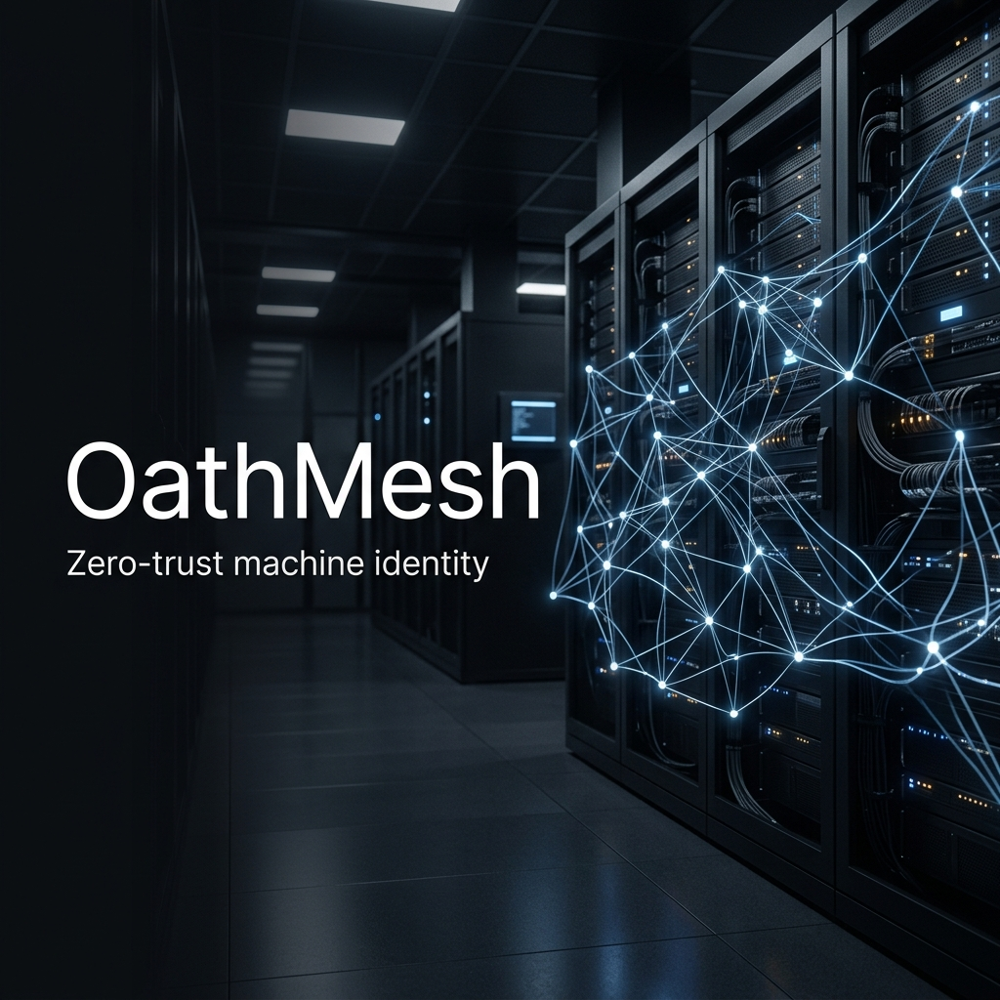

<p align="center">
  
</p>

<h1 align="center">OathMesh</h1>

<p align="center">
  <b>🔐 Every machine call gets a short-lived, signed identity.</b>
</p>

<p align="center">
  
</p>

<p align="center">
  Stop leaking API keys. Replace static secrets with cryptographically verified tokens that expire in 5 minutes or less.
</p>

> ⚠️ **Pre-production:** OathMesh has not yet received an independent security audit. Do not use in production until v1.1.0 or later, which will include a third-party audit report.

<p align="center">
  <a href="https://github.com/oathmesh/oathmesh/actions/workflows/ci.yml">
    
  </a>
  <a href="https://github.com/oathmesh/oathmesh/tree/main/sdk/node">
    
  </a>
  <a href="https://github.com/oathmesh/oathmesh/releases">
    
  </a>
  <a href="https://github.com/oathmesh/oathmesh/releases">
    
  </a>
  <a href="https://github.com/oathmesh/oathmesh/blob/main/LICENSE">
    
  </a>
  <a href="https://github.com/oathmesh/oathmesh/stargazers">
    
  </a>
  <a href="https://github.com/oathmesh/oathmesh/graphs/contributors">
    
  </a>
</p>

---

## ✨ Features

- 🔑 **Zero API Keys** — No more long-lived secrets in environment variables
- ⏱️ **Short-Lived Tokens** — Maximum 300 seconds TTL, auto-expiring credentials
- 🛡️ **Zero-Trust Security** — Every request must prove its identity
- 🔒 **Ed25519 Signatures** — Modern elliptic curve cryptography
- 📋 **14-Step Verification** — Fail-closed pipeline rejects malformed/expired/replayed tokens
- 🌍 **Polyglot SDKs** — Go, Node.js (TypeScript), and Python supported
- 📊 **Full Audit Trail** — Every allow and deny logged as NDJSON
- 🔄 **Policy-Driven** — Apple Pkl-based rules, hot-reload, default deny
- 🌐 **Gateway Mode** — Reverse proxy that injects verified context headers

---

## 📚 SDKs

| Language | Package | Frameworks |
|----------|---------|------------|
| **Go** | [`github.com/oathmesh/oathmesh`](https://github.com/oathmesh/oathmesh) | chi, stdlib `net/http` |
| **Node.js** | [`@oathmesh/oathmesh`](https://github.com/oathmesh/oathmesh/tree/main/sdk/node) | Express, **Next.js** (App, Pages, Edge) |
| **Python** | [`oathmesh-sdk`](https://github.com/oathmesh/oathmesh/releases) | FastAPI, Flask, Django |

### SDK Feature Comparison

| Feature | Go SDK | Node.js SDK | Python SDK |
|---------|--------|-------------|------------|
| **Token verification** | ✅ Full 14-step | ✅ Full 14-step | ✅ Full 14-step |
| **alg:none rejection** | ✅ | ✅ | ✅ |
| **Exact audience match** | ✅ | ✅ | ✅ |
| **rqh binding** | ✅ | ✅ | ✅ |
| **Replay cache** | ✅ Built-in | ✅ Built-in (InMemoryReplayCache) | ✅ Built-in (InMemoryReplayCache) |
| **Policy evaluation** | ✅ Built-in (Pkl) | ✅ Built-in (JSON) | ✅ Built-in (JSON) |

> **Note:** All three SDKs now implement the full 14-step verification pipeline including replay protection and policy evaluation. The Go SDK uses Pkl for policy, while Node.js and Python SDKs use simple JSON-based policies. Use `requireRequestBinding: true` (Node) or `require_request_binding=True` (Python) for write/mutate endpoints.

---

## 🚀 Quick Start

### Option 1: Docker (Fastest)

```bash
# Start the issuer and demo services
docker-compose up -d

# Mint a token
TOKEN=$(docker compose exec oathmesh ./bin/oathmesh mint \
  --sub "agent://repo/acme/deploy-bot" \
  --aud "https://inventory.internal" \
  --act "deploy" --quiet)

# Call a protected API
curl -H "Authorization: OathMesh $TOKEN" http://localhost:8081/inventory
```

### Option 2: From Source

```bash
git clone https://github.com/oathmesh/oathmesh.git
cd oathmesh

# Generate a development key
openssl genpkey -algorithm Ed25519 -out private.pem

# Build the CLI
make build

# Start services
docker-compose up -d

# Mint a token
TOKEN=$(./bin/oathmesh mint \
  --sub "agent://repo/acme/deploy-bot" \
  --aud "https://inventory.internal" \
  --act "deploy" --quiet)

# Call a protected API
curl -H "Authorization: OathMesh $TOKEN" http://localhost:8081/inventory
```

Run `./demo.sh` for the full automated golden-path demo.

---

## 📦 Installation

### Go

```bash
go install github.com/oathmesh/oathmesh/cmd/oathmesh@latest
```

### Node.js / TypeScript

```bash
npm install @oathmesh/oathmesh
# or
yarn add @oathmesh/oathmesh
# or
pnpm add @oathmesh/oathmesh
```

### Python

```bash
pip install oathmesh-sdk
# or
poetry add oathmesh
```

### Docker

```bash
docker pull oathmesh/oathmesh:latest
```

---

## 💻 Usage Examples

### Go Middleware

```go
r.Use(middleware.OathMeshMiddleware(cfg))
caller := middleware.CallerFrom(r.Context())
// caller.Principal.Subject, caller.Action, caller.TokenID
```

### Express (TypeScript)

```typescript
import { verifyToken } from '@oathmesh/oathmesh';

app.use(verifyToken({ audience, trustedIssuers }));
// req.oathmeshContext is fully typed
```

### Next.js (App Router)

```typescript
import { withOathMesh } from '@oathmesh/oathmesh/next';

const oathmesh = withOathMesh({ audience, trustedIssuers });

export async function GET(request: NextRequest) {
  const { caller, error } = await oathmesh(request);
  if (error) return error;
  return NextResponse.json({ subject: caller.principal.subject });
}
```

### FastAPI (Python)

```python
from oathmesh import verify_token, VerifierConfig

caller = verify_token(request.headers["authorization"], config)
# caller.principal.subject, caller.action, caller.token_id
```

---

## ⚖️ Comparison

| Feature | API Keys | Traditional JWT | OathMesh |
|---------|----------|------------------|----------|
| **Lifetime** | Infinite (leaked = compromised) | Hours to days | ≤ 300 seconds |
| **Cryptography** | None (just strings) | HS256, RS256 common | Ed25519 only |
| **Replay Protection** | ❌ | ❌ | ✅ Unique `jti` per token |
| **Policy Engine** | ❌ | ❌ | ✅ Pkl-based rules |
| **Audit Logging** | ❌ | Optional | ✅ Every allow/deny |
| **Scoped Actions** | ❌ | Optional | ✅ `act` claim required |

---

## 🏗️ Architecture

```
┌──────────┐    ┌─────────┐    ┌─────────────────────┐
│ Caller   │───▶│ Issuer  │───▶│ Signs Oath Token    │
│ (bot, CI,│    │         │    │ (Ed25519, ≤300s TTL)│
│  service)│    └─────────┘    └─────────────────────┘
└──────────┘                         │
                     ┌────────────────┴────────────┐
                     ▼                             ▼
              ┌──────────────┐              ┌──────────────┐
              │   Receiver   │              │   Gateway    │
              │  (your API)  │              │ (proxy mode) │
              └──────────────┘              └──────────────┘
                     │                             │
              ┌──────┴──────┐               ┌───────┴───────┐
              │ 14-step     │               │ Injects       │
              │ verification│               │ X-OathMesh-*  │
              │ pipeline    │               │ headers       │
              └─────────────┘               └───────────────┘
```

**Gateway Mode** (`oathmesh serve --gateway`): A reverse proxy that verifies tokens and injects security context headers into your existing upstream services.

---

## 🗺️ Roadmap

- 🔜 **Rust SDK** — Coming soon
- 🔜 **Java SDK** — Coming soon  
- 🗓️ **Enhanced Gateway** — mTLS support, rate limiting
- 🗓️ **Policy UI** — Visual policy editor
- 🗓️ **Audit Dashboard** — Web-based log viewer
- 🗓️ **More Issuers** — GitLab CI, GitHub App exchange

---

## 🤝 Contributing

Contributions are welcome! Here's how to get started:

1. **Fork** the repository
2. **Clone** your fork: `git clone https://github.com/YOUR_USERNAME/oathmesh.git`
3. **Create a branch**: `git checkout -b feature/your-feature-name`
4. **Make your changes** and add tests
5. **Run tests**: `make test` (Go) / `npm test` (Node) / `pytest` (Python)
6. **Submit a PR** — We'll review and merge!

See [CONTRIBUTING.md](CONTRIBUTING.md) for detailed guidelines.

---

## ⭐ Show Your Support

If OathMesh helps you build safer systems, please:

- **Star** this repository ⭐
- **Share** it with your team
- **Open an issue** if you find a bug or have a feature request
- **Contribute** — We need SDKs for more languages!

[](https://github.com/oathmesh/oathmesh)

---

## 📖 Documentation

### Quickstarts
- [Protect a Go chi API](docs/quickstarts/protect-chi-api.md)
- [Protect an Express API](docs/quickstarts/protect-express-api.md)
- [Protect a Next.js API](docs/quickstarts/protect-nextjs-api.md)
- [Protect a FastAPI service](docs/quickstarts/protect-fastapi.md)
- [GitHub Actions to internal API](docs/quickstarts/github-actions-to-internal-api.md)

### Protocol & Security
- [Token Format](docs/protocol/token-format.md) · [Claim Reference](docs/protocol/claim-reference.md)
- [Verification Rules](docs/protocol/verification-rules.md) · [Threat Model](docs/security/threat-model.md)
- [Replay Defense](docs/security/replay-defense.md) · [Key Management](docs/security/key-management.md)

---

## 🔒 Security

For security vulnerabilities, please see [SECURITY.md](SECURITY.md). **Do NOT open a public issue** for security vulnerabilities.

---

## 📄 License

[MIT](LICENSE)

---

<p align="center">
  Built with ❤️ by the <a href="https://github.com/oathmesh/oathmesh/graphs/contributors">OathMesh team</a>
</p>
